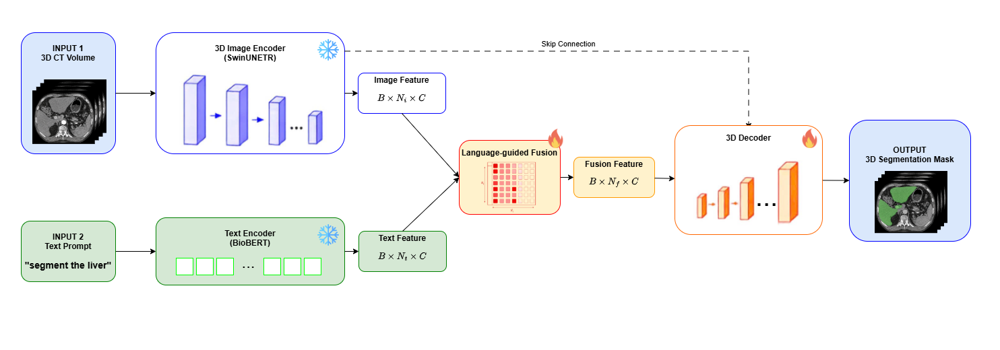
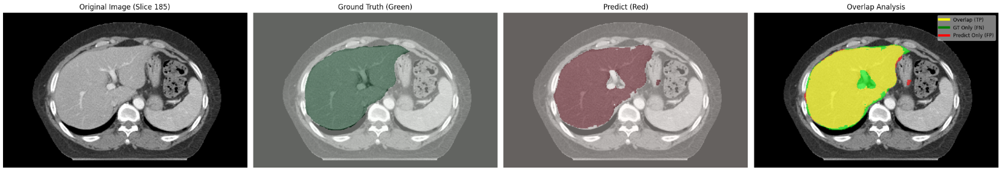
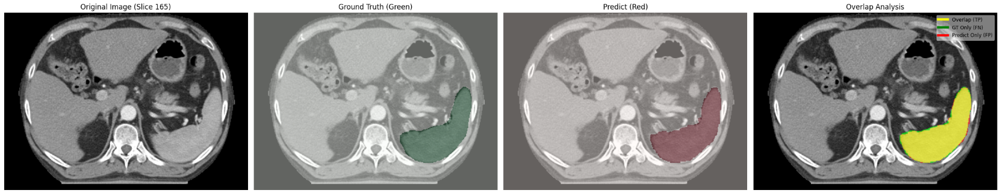
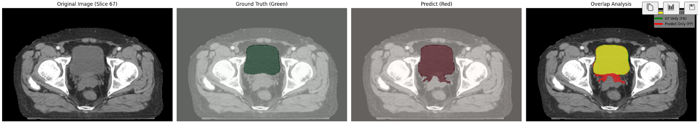

# Multimodal 3D Medical Image Segmentation

A deep learning framework for 3D organ segmentation using multimodal inputs combining medical images with text descriptions. This project implements a fusion-based architecture that leverages both visual and textual information for improved segmentation accuracy.

## Overview

This project implements a **MultiModalSegModel** that:

- Encodes 3D medical images using a Swin Vision Transformer (SwinUNETR)
- Processes text descriptions using BioBERT (biomedical BERT)
- Fuses visual and textual features via cross-modal attention
- Decodes fused features to produce organ segmentation masks

### Key Features

- 3D volumetric segmentation support
- Cross-modal attention-based feature fusion
- Early stopping and checkpoint management
- Per-organ evaluation metrics (Dice, Hausdorff Distance 95%)
- Support for multiple organ types

## Architecture




### Components

#### 1. **ImageEncoder3D** (`models/image_encoder.py`)

- Backbone: SwinUNETR (Vision Transformer with window attention)
- Input: 3D medical images `[B, 1, D, H, W]`
- Output: Image embeddings `[B, N, 768]` + spatial shape + skip connections

#### 2. **TextEncoder** (`models/text_encoder.py`)

- Model: BioBERT (dmis-lab/biobert-base-cased-v1.1)
- Input: Tokenized text descriptions
- Output: Text embeddings `[B, T, 768]`

#### 3. **CrossModalFusion** (`models/fusion.py`)

- Mechanism: Multi-head attention with layer normalization
- Query: Image embeddings
- Key/Value: Text embeddings
- Output: Fused features `[B, N, 768]`

#### 4. **Decoder3D** (`models/decoder.py`)

- Reconstructs 3D volumes from fused embeddings
- Uses skip connections from encoder
- Output: Segmentation mask `[B, 1, D, H, W]`

#### 5. **MultiModalSegModel** (`models/multimodal_model.py`)

- Orchestrates all components
- Combines image, text, and fusion modules

## Installation

### Requirements

Install dependencies from `requirements.txt`:

```bash
pip install -r requirements.txt
```

### Project Structure

```
ORGAN-SEG/
├── models/
│   ├── multimodal_model.py      # Main model architecture
│   ├── image_encoder.py         # 3D image encoder (SwinUNETR)
│   ├── text_encoder.py          # Text encoder (BioBERT)
│   ├── fusion.py                # Cross-modal fusion module
│   └── decoder.py               # 3D decoder
├── datasets/
│   ├── dataset.py               # Dataset builder
│   ├── data_paths.py            # Data path utilities
│   └── text_utils.py            # Text processing utilities
├── losses/
│   └── loss.py                  # Loss functions (DiceFocalLoss)
├── trainers/
│   ├── trainer.py               # Training loop
│   ├── optim.py                 # Optimizer and scheduler
├── scripts/
│   ├── train.py                 # Training entry point
│   ├── test.py                  # Testing and evaluation
│   └── early_stopping.py        # Early stopping callback
├── utils/
│   ├── transforms.py            # Data augmentation
│   ├── predict.py               # Inference utilities
│   ├── freeze.py                # Encoder freezing utilities
│   └── history.py               # Training history logging
├── data/                        # raw dataset
├── data_preprocessed/           # preprocessed dataset
├── ckpt/                        # checkpoints
└── README.md
```

## Data Structure

### Input Format

Expected data directory structure:

```
data/
├── train/
│   ├── organ1/
│   │   ├── image_001.nii.gz
│   │   ├── label_001.nii.gz
│   │   └── text_001.txt
│   └── organ2/
├── val/
│   └── ...
└── test/
    └── ...
```

### Text Descriptions

Each image has an associated text file containing organ description, clinical context, or anatomical features.

Example: "Extract the liver in this CT scan"

## Usage

### Data preprocessing

Run the preprocessing script

```bash
python preprocess/preprocess.py
```

### Training

Run the training script:

```bash
python scripts/train.py
```

#### Configuration (in `scripts/train.py`)

- **TRAIN_ROOT**: Training data path (default: `./data_preprocessed/train`)
- **VAL_ROOT**: Validation data path (default: `./data_preprocessed/val`)
- **CKPT_DIR**: Checkpoint directory (default: `./ckpt`)
- **ADDITIONAL_EPOCHS**: Number of epochs to train (default: 20)
- **VAL_INTERVAL**: Validation frequency (default: 1 epoch)
- **PATIENCE**: Early stopping patience (default: 8)

### Testing/Evaluation

Run evaluation on test set:

```bash
python scripts/test.py
```

#### Output

##### Quantitative Results

```
Dice Score: 0.6092

=== Per-organ Dice ===
Adrenal_Left: 0.0561
Adrenal_Right: 0.0906
Bladder: 0.6637
Colon: 0.5607
Duodenum: 0.4191
Esophagus: 0.4532
Gallbladder: 0.3735
Head_of_femur_Left: 0.7981
Head_of_femur_Right: 0.7784
Intestine: 0.6857
Kidney_Left: 0.7344
Kidney_Right: 0.8273
Liver: 0.9123
Multi_Organs_Test: 0.6642
Pancreas: 0.5073
Prostate: 0.6305
Rectum: 0.6247
Seminal_vesicles: 0.4601
Spleen: 0.8306
Stomach: 0.7845
```

##### Qualitative Results

Each row shows, from left to right: the original CT slice, the ground truth mask (green), the model prediction (red), and an overlap analysis where **yellow = Overlap (TP)**, **green = GT Only (FN)**, and **red = Predict Only (FP)**.

**Liver** — Text prompt: `"Segment the liver in this abdominal CT scan"`



**Spleen** — Text prompt: `"Extract the spleen from this CT volume"`



**Bladder** — Text prompt: `"Delineate the urinary bladder in this pelvic CT scan"`



## Training Details

### Loss Function

- **DiceFocalLoss**: Combination of Dice and Focal loss
  - λ_dice = 1.0
  - λ_focal = 1.0
  - γ = 2.0

### Data Processing

- **Sliding Window Inference**: ROI size (96, 96, 96)
- **Post-processing**:
  - Sigmoid activation
  - Thresholding at 0.5
  - Small component removal (size < 250 voxels)

## Metrics

### Dice Score

Overlap metric between predicted and ground truth segmentation:

```
Dice = 2|X ∩ Y| / (|X| + |Y|)
```

## Encoder Freezing

By default, image and text encoders are frozen during training to:

- Leverage pre-trained weights (SwinUNETR, BioBERT)
- Reduce computational cost
- Stabilize training

## Checkpointing

The system maintains two checkpoints:

1. **best_checkpoint.pth**: Best model based on validation Dice
2. **latest_checkpoint.pth**: Latest epoch checkpoint (for resuming)

Each contains:

```python
{
    "epoch": int,
    "model_state_dict": dict,
    "optimizer_state_dict": dict,
    "scheduler_state_dict": dict,
    "val_loss": float,
    "dice": float,
    "train_loss": float,
}
```

## Contributors

Graduation thesis - HCMUT - HK252

- Đặng Hữu Nhật Hoàng
- Nguyễn Anh Lâm
- Vũ Minh Quân
